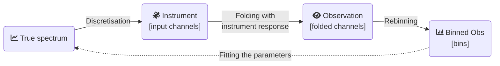

# Internal working of `jaxspec`

## Data structure for observations

[`Observation`][jaxspec.data.observation.Observation] is the main data structure to handle X-ray data. Observations in X-ray carry a lot
of data and metadata. The main data are the following :

- `energies` : the energy bins of the spectrum
- `counts` : the counts in each energy channel

Our entrypoint to the X-ray data is the [`OGIP`](https://heasarc.gsfc.nasa.gov/docs/heasarc/ofwg/docs/spectra/ogip_92_007/node5.html) standard.

