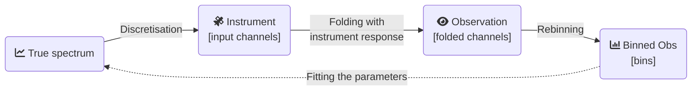

# Internal working of `jaxspec`

## Data structure for observations

[`Observation`][jaxspec.data.observation.Observation] is the main data structure to handle X-ray data. Observations in X-ray carry a lot
of data and metadata. The main data are the following :

- `counts` : the counts in each instrument channel
- `folded_counts` : the counts after grouping
- `grouping` : the sparse channel → bin grouping matrix
- `quality` : the per-channel quality flag

An [`Observation`][jaxspec.data.observation.Observation] carries **no energy axis** of its
own: a PHA file records counts per *channel*, and the mapping from channel to energy lives
in the response. That axis is on
[`Instrument`][jaxspec.data.instrument.Instrument] (`e_min_channel` / `e_max_channel` for
the folded side, `e_min_unfolded` / `e_max_unfolded` for the model side), which is exactly
why the two are joined into an
[`ObsConfiguration`][jaxspec.data.obsconf.ObsConfiguration] before fitting.

Our entrypoint to the X-ray data is the [`OGIP`](https://heasarc.gsfc.nasa.gov/docs/heasarc/ofwg/docs/spectra/ogip_92_007/node5.html) standard.

```mermaid
flowchart LR
    T("fa:fa-chart-line True spectrum");
    II("fa:fa-satellite Instrument <br> [input channels]");
    IO("fa:fa-eye  Observation <br> [folded channels]");
    O("fa:fa-chart-column Binned Obs <br> [bins]");
    T --> |" Discretisation "| II;
    II --> |" Folding with <br> instrument response "| IO;
    IO --> |" Rebinning "| O;
    O -.Fitting the parameters.-> T;
```