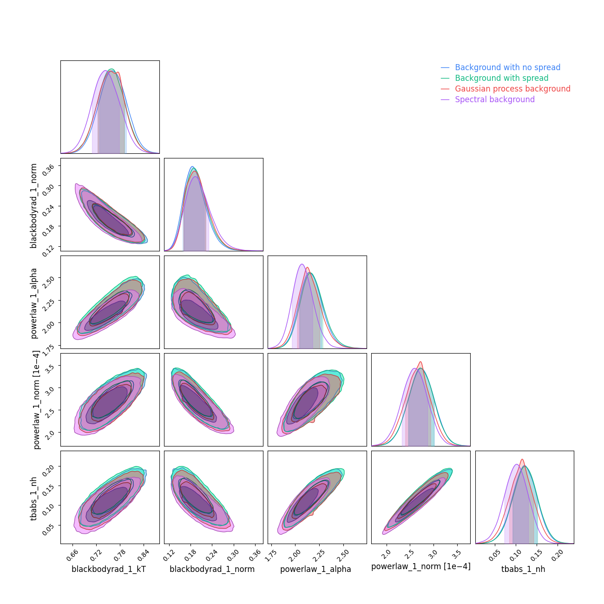

# Add a background model to your fit

Most of the time, the X-ray spectrum is extracted around the source, and
an additional spectrum is extracted further away to get a *representative*
X-ray background in the vicinity of your observation. With `jaxspec`, this
spectrum is automatically loaded as long as it is defined in the header of
your observation.

To include this in your spectral fitting, you should add a `BackgroundModel` to your code as follows. The simplest
approach is equivalent to subtract the background to the observed spectrum when performing the fit.

``` python
from jaxspec.model.background import SubtractedBackground

fitter = MCMCFitter(model, prior, obs, background_model=SubtractedBackground())
result_bkg_substracted = fitter.fit(num_chains=16, num_warmup=1000, num_samples=5000, mcmc_kwargs={"progress_bar": True})

result_bkg_substracted.plot_ppc()
```


The `SubtractedBackground` simply account for the observed counts without propagating any kind of dispersion, which
is clearly bad when we want to get spectral parameters with a comprehensive error budget. The simplest way to deal with
it is to consider each background bin as a Poisson realisation of a counting process, which is achieved here using
`BackgroundWithError`.

``` python
from jaxspec.model.background import BackgroundWithError

fitter = MCMCFitter(model, prior, obs, background_model=BackgroundWithError())
result_bkg_with_spread = fitter.fit(num_chains=16, num_warmup=1000, num_samples=5000, mcmc_kwargs={"progress_bar": True})

result_bkg_with_spread.plot_ppc()
```


The other way to deal with this is to directly fit a Gaussian process on the folded background spectrum to integrate
energy and bins correlations in a very empiric way. This can be done using a `GaussianProcessBackground`. The number of
nodes will drive the flexibility of the Gaussian process, and it should always be lower than the number of channels.

``` python
from jaxspec.model.background import GaussianProcessBackground

forward = MCMCFitter(model, prior, obs, background_model=GaussianProcessBackground(e_min=0.3, e_max=8, n_nodes=20))
result_bkg_gp = forward.fit(num_chains=16, num_warmup=1000, num_samples=5000, mcmc_kwargs={"progress_bar": True})

result_bkg_gp.plot_ppc()
```


This is also possible to use a spectral model that will be folded within the instrument background using a `SpectralModelBackground`.

``` python
from jaxspec.model.background import SpectralModelBackground

spectral_model_background = Powerlaw()
background_prior = {
    "powerlaw_1_alpha": dist.Uniform(0, 5),
    "powerlaw_1_norm": dist.LogUniform(1e-8, 1e-3),
}

forward = MCMCFitter(model, prior, obs, background_model=SpectralModelBackground(spectral_model_background, background_prior))
result_bkg_spectral = forward.fit(num_chains=16, num_warmup=1000, num_samples=5000, mcmc_kwargs={"progress_bar": True})

result_bkg_spectral.plot_ppc()
```


We can compare the results for all these background models using the `plot_corner_comparison` function.

``` python
from jaxspec.analysis.compare import plot_corner_comparison

plot_corner_comparison(
    {
        "Background with no spread" : result_bkg_substracted,
        "Background with spread" : result_bkg_with_spread,
        "Gaussian process background" : result_bkg_gp,
        "Spectral background" : result_bkg_spectral
    }
)
```


