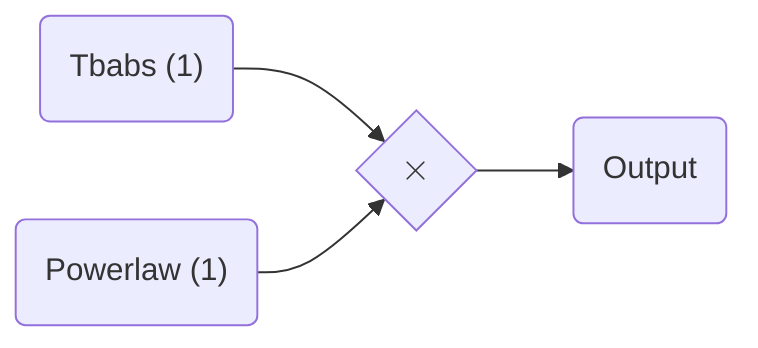
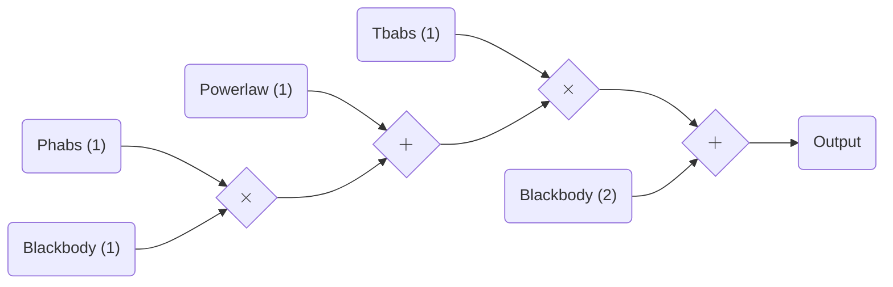

# Model building made easy

With `jaxspec`, you can easily build a model in the same fashion as you would do using
your favorite spectral fitting library. The following example shows how to build simple
models using additive and multiplicative components.

```python
from jaxspec.model.additive import Powerlaw
from jaxspec.model.multiplicative import Tbabs

model_simple = Tbabs() * Powerlaw()
```

These lines will build a simple absorbed powerlaw model. It can be
represented with the following graph.



Using the Additive and Multiplicative components defined in `jaxspec`, you can
build arbitrary complex models, in the same fashion as you would do in other
spectral fitting libraries.

```python
from jaxspec.model.additive import Blackbody, Powerlaw
from jaxspec.model.multiplicative import Tbabs, Phabs

model_complex = Tbabs() * (Powerlaw() + Phabs() * Blackbody()) + Blackbody()
```

This build the following model


