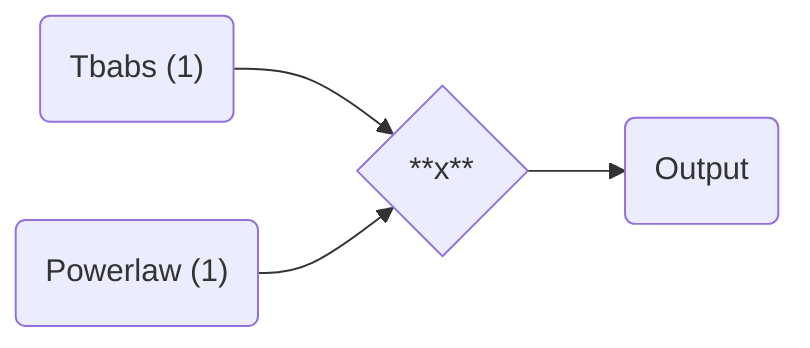
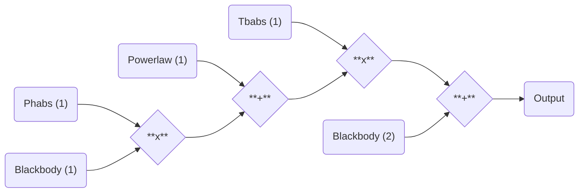
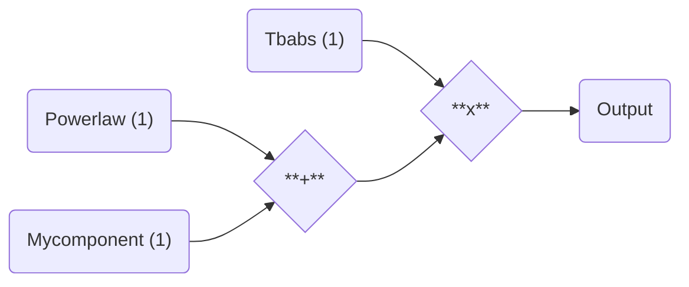

# Model building made easy

## Nesting components

With `jaxspec`, you can easily build a model in the same fashion as you would do using
your favorite spectral fitting library. The following example shows how to build simple
models using additive and multiplicative components.

```python
from jaxspec.model.additive import Powerlaw
from jaxspec.model.multiplicative import Tbabs

model_simple = Tbabs() * Powerlaw()
```

These lines will build a simple absorbed powerlaw model. It can be
represented with the following graph.



Using the Additive and Multiplicative components defined in `jaxspec`, you can
build arbitrary complex models, in the same fashion as you would do in other
spectral fitting libraries.

```python
from jaxspec.model.additive import Blackbody, Powerlaw
from jaxspec.model.multiplicative import Tbabs, Phabs

model_complex = Tbabs() * (Powerlaw() + Phabs() * Blackbody()) + Blackbody()
```

This build the following model



## Build a custom component

`jaxspec` enables the build of custom components. This is useful if you want to build a model with a component that is not implemented in `jaxspec`.

### Additive component

In this example, we will first build a component with a known analytical expression. Let's assume we want to model the following function:

$$
\begin{align}
\mathcal{M}_\text{add}( E ) &= K \sin (E/E_0) \exp (-E/E_1)
\end{align}
$$

Using `jaxspec`, this is fairly easy. The only thing required is that every function should be computable using `JAX` primitives. Since `JAX` implements
most of the `numpy` functions and a lot of `scipy` functions (see [here](https://jax.readthedocs.io/en/latest/jax.html)), this should not be a problem in the simplest cases.

```python
import jax.numpy as jnp
import flax.nnx as nnx
from jaxspec.model.abc import AdditiveComponent


class MyComponent(AdditiveComponent):
    def __init__(self):
        self.K = nnx.Param(0.5)
        self.E0 = nnx.Param(1.0)
        self.E1 = nnx.Param(1.0)

    def continuum(self, energy):
        return self.K * jnp.sin(energy / self.E0) * jnp.exp(-energy / self.E1)
```

Let's understand in depth this code snippet. First, we define a class that inherits from [`AdditiveComponent`][jaxspec.model.abc.AdditiveComponent].
This class is an abstract class that defines the interface of an additive component. This interface is composed of two methods: [`continuum`][jaxspec.model.abc.AdditiveComponent.continuum] and [`integrated_continuum`][jaxspec.model.abc.AdditiveComponent.integrated_continuum].
These functions will be called by the model to compute the defined continuum and integrate it, and add the integrated continuum.

To do a quick summary of what is required to build a custom component, we need to:

 1. Inherit from [`AdditiveComponent`][jaxspec.model.abc.AdditiveComponent]
 2. Implement the [`continuum`][jaxspec.model.abc.AdditiveComponent.continuum] method (optional)
 3. Implement the [`integrated_continuum`][jaxspec.model.abc.AdditiveComponent.integrated_continuum] method (optional)
 4. Ensure that the parameters to fit are defined using [`nnx.Param`][flax.nnx.Param]

And that's all. The newly created component is directly combinable with other components, and can be used to build more complex spectral model.

```python
from jaxspec.model.additive import Powerlaw
from jaxspec.model.multiplicative import Tbabs

model = Tbabs() * (Powerlaw() + MyComponent())
```



### Multiplicative component
Let's do the same implementation for a multiplicative component. In this example, we will use the following analytical expression:

$$
\begin{align}
\mathcal{M}_\text{mul}( E ) &= | \cos(E/E_0) |
\end{align}
$$

The same logic applies, you must inherit from the [`MultiplicativeComponent`][jaxspec.model.multiplicative.MultiplicativeComponent] and implement the [`factor`][jaxspec.model.abc.MultiplicativeComponent.factor] method.

```python

from jaxspec.model.abc import MultiplicativeComponent

class MyFactor(MultiplicativeComponent):
    def __init__(self):
        self.E0 = nnx.Param(1.0)

    def factor(self, energy):
        return jnp.abs(jnp.cos(energy / self.E0))
```