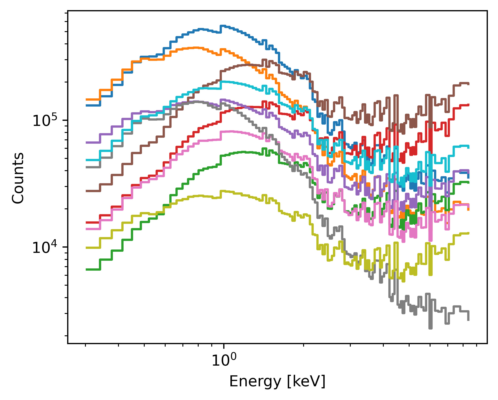

# Generate mock data

## Basic usage

This tutorial illustrates how to make generate mock observed spectra using `fakeit` - like interface
as proposed by XSPEC.

``` python
import numpyro

numpyro.enable_x64()
numpyro.set_platform("cpu")
```

Let's build a model we want to fake and load an observation with the instrumental setup which should be applied

``` python
from jaxspec.model.additive import Powerlaw, Blackbodyrad
from jaxspec.model.multiplicative import Tbabs
from jaxspec.data import ObsConfiguration

obsconf = ObsConfiguration.from_pha_file('obs_1.pha')
model = Tbabs() * (Powerlaw() + Blackbodyrad())
```

Let's do fakeit for a bunch of parameters

``` python
from numpy.random import default_rng

rng = default_rng(42)

num_params = 10000

parameters = {
    "tbabs_1_nh": rng.uniform(0.1, 0.4, size=num_params),
    "powerlaw_1_alpha": rng.uniform(1, 3, size=num_params),
    "powerlaw_1_norm": rng.exponential(10 ** (-0.5), size=num_params),
    "blackbodyrad_1_kT": rng.uniform(0.1, 3.0, size=num_params),
    "blackbodyrad_1_norm": rng.exponential(10 ** (-3), size=num_params)
}
```

And now we can fakeit!

``` python
from jaxspec.data.util import fakeit_for_multiple_parameters

spectra = fakeit_for_multiple_parameters(obsconf, model, parameters)
```

Let's plot some of the resulting spectra

``` python
import matplotlib.pyplot as plt

plt.figure(figsize=(5,4))

for i in range(10):

    plt.step(
        obsconf.out_energies[0],
        spectra[i, :],
        where="post"
    )

plt.xlabel("Energy [keV]")
plt.ylabel("Counts")
plt.loglog()
```



## Using only the instrument

If you don't have any observation you can use as a reference, you can still build a mock [`ObsConfiguration`][jaxspec.data.ObsConfiguration]
using the instrument you want to use.

``` python
from jaxspec.data import ObsConfiguration, Instrument

instrument = Instrument.from_ogip_file(
    "instrument.rmf",
    arf_path="instrument.arf"
)

obsconf = ObsConfiguration.mock_from_instrument(
    instrument,
    exposure=1e5,
)
```

Then you can use this [`ObsConfiguration`][jaxspec.data.ObsConfiguration] within `fakeit_for_multiple_parameters` as before.

``` python
spectra = fakeit_for_multiple_parameters(obsconf, model, parameters)
```


## Computing in parallel

Thanks to the amazing [PositionalSharding](https://jax.readthedocs.io/en/latest/jax.sharding.html#jax.sharding.PositionalSharding)
interface, it is fairly easy to do this computation in parallel using a sharding on the input parameters. To do so, one
must first declare multiple devices using one of the following codes.

=== "With numpyro"

    ``` python
    import numpyro

    n_devices = 8

    numpyro.set_platform("cpu")
    numpyro.set_host_device_count(n_devices)
    numpyro.enable_x64()
    ```

=== "With JAX"

    ``` python
    import os
    import jax

    n_devices = 8

    os.environ["XLA_FLAGS"] = f"--xla_force_host_platform_device_count={n_devices}"
    jax.config.update("jax_platform_name", "cpu")
    jax.config.update("jax_enable_x64", True)
    ```

This must be run **before any `JAX` code is run in the process** otherwise the extra cores won't be accessible. To
double-check, you can ensure that the available number of devices is consistent with `n_devices`

``` python

assert len(jax.local_devices()) == n_devices
```

Once it is certain that all the devices are visible, the array can be split using a [PositionalSharding](https://jax.readthedocs.io/en/latest/jax.sharding.html#jax.sharding.PositionalSharding)
and distributed to all the devices.

``` python
import jax
from jax.experimental import mesh_utils
from jax.sharding import PositionalSharding

# Create a Sharding object to distribute a value across devices:
sharding = PositionalSharding(mesh_utils.create_device_mesh((n_devices,)))

# Split the parameters on every device

sharded_parameters = jax.device_put(parameters, sharding)
```

Then we can use these sharded parameters to compute the fakeits in parallel

``` python
fakeit_for_multiple_parameters(obsconf, model, sharded_parameters, apply_stat=False)
```

!!! info

    Since JAX is pretty well optimized at getting the best from your physical CPU, the gain by enforcing parallel
    execution might not be gigantic. However, doing so on several GPUs or TPUs will greatly improve the execution time.
