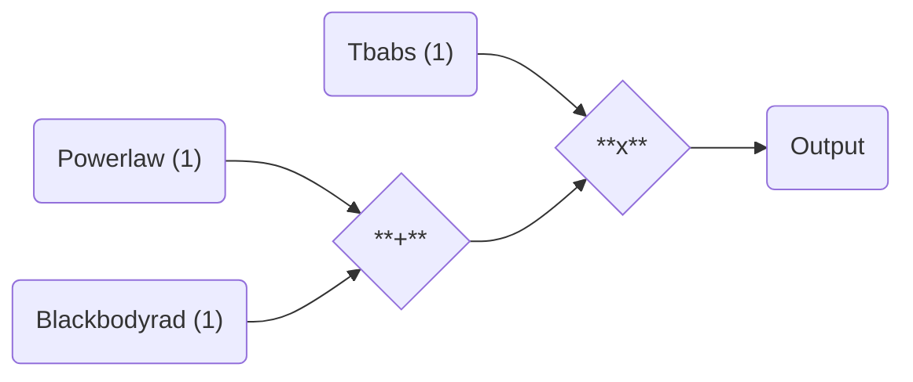
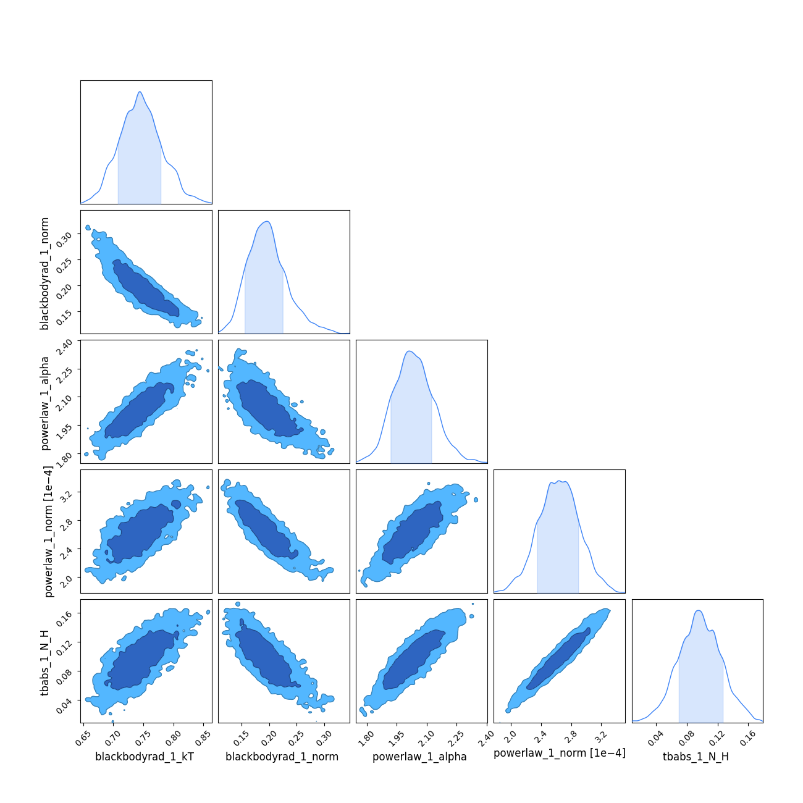
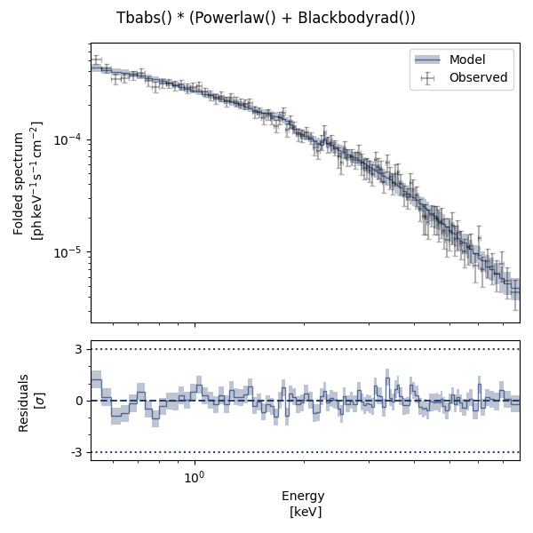

# `jaxspec` fitting speedrun

In this example, the basic spectral fitting workflow is illustrated on a XMM-Newton observation of the
pulsating candidate NGC 7793 ULX-4 from [Quintin & $al.$ (2021)](https://ui.adsabs.harvard.edu/abs/2021MNRAS.503.5485Q/abstract).

```python
import numpyro

numpyro.enable_x64()
numpyro.set_platform("cpu") # (1)!
numpyro.set_host_device_count(16) # (2)!
```

1. In general `JAX` will automatically look for `cuda` or `tpu` devices. If you work with GPUs/TPUs, remove this line.
2. Change this number to the number of cores you want to use. If you work with GPUs/TPUs, remove this line.


!!! Warning

    These lines are extremely important and must be run **at the beginning** of most of your scripts. It tells `JAX` how
    many cores you want to use and enforces the double precision, which is crucial when running MCMC.

## Define your model

The first step consists in building a model using various components available in `jaxspec`.

```python
from jaxspec.model.additive import Powerlaw, Blackbodyrad
from jaxspec.model.multiplicative import Tbabs

spectral_model = Tbabs()*(Powerlaw() + Blackbodyrad())
```

Which will produce the following model:



## Load your data

The second step consists in defining the data to be fitted.

```python
from jaxspec.data import ObsConfiguration
obs = ObsConfiguration.from_pha_file('your.pha', low_energy=0.3, high_energy=12) # (1)!
```

1.  In this example, we load the data using `#!python obs = load_example_obsconf("NGC7793_ULX4_PN")`
    which can be imported from `#!python jaxspec.data.util`

## Perform the inference

```python
import numpyro.distributions as dist
from jaxspec.fit import MCMCFitter

prior = {
    "powerlaw_1_alpha": dist.Uniform(0, 5),
    "powerlaw_1_norm": dist.LogUniform(1e-5, 1e-2),
    "blackbodyrad_1_kT": dist.Uniform(0, 5),
    "blackbodyrad_1_norm": dist.LogUniform(1e-2, 1e2),
    "tbabs_1_nh": dist.Uniform(0, 1)
}

forward = MCMCFitter(spectral_model , prior , obs)
result = forward.fit(num_chains=16, num_warmup=1000, num_samples=5000) # (1)!
```

1.  1000 warmup steps and 1000 samples are a good starting point for most of the cases. We put 5000 to have smoother plots here.

## Gather results

Finally, you can print the results, in a LaTeX table for example. The `result.table()`
will return a $\LaTeX$ compilable table. You can also plot the parameter covariances using the `plot_corner` method.

```python
result.plot_corner()
```



You can also plot the posterior predictive spectra on this observation.

```python
result.plot_ppc(plot_components=True, n_sigmas=2)
```


