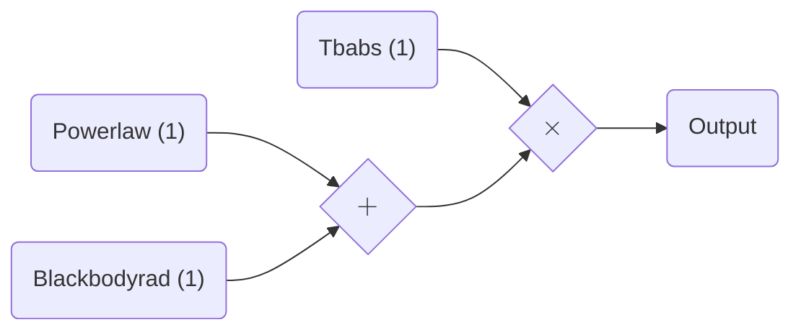
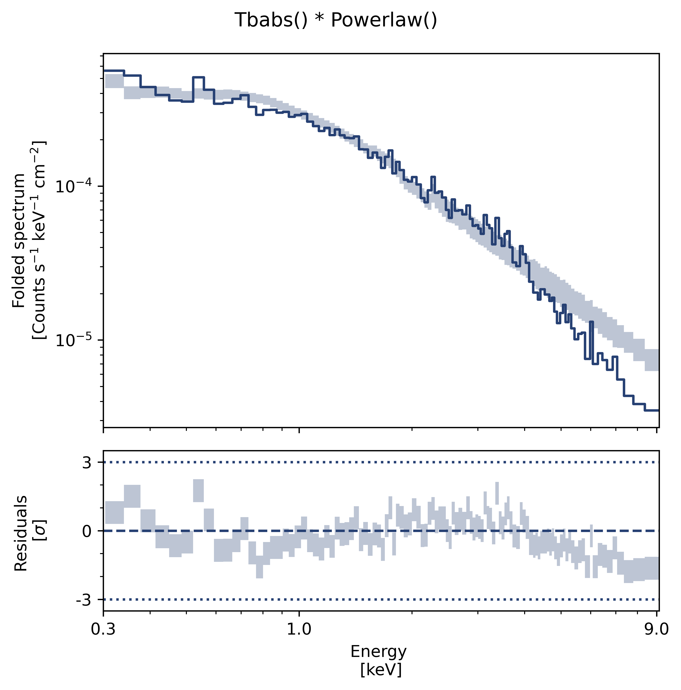

# `jaxspec` fitting speedrun

In this example, the basic spectral fitting workflow is illustrated on a XMM-Newton observation of the
pulsating candidate NGC 7793 ULX-4 from [Quintin & $al.$ (2021)](https://ui.adsabs.harvard.edu/abs/2021MNRAS.503.5485Q/abstract).

``` python
import numpyro

numpyro.enable_x64()
numpyro.set_platform("cpu")
numpyro.set_host_device_count(4)
```

## Define your model

The first step consists in building a model using various components available in `jaxspec`.

``` python
from jaxspec.model.additive import Powerlaw, Blackbodyrad
from jaxspec.model.multiplicative import Tbabs

spectral_model = Tbabs()*(Powerlaw() + Blackbodyrad())
```

Which will produce the following model:



## Load your data

The second step consists in defining the data to be fitted.

``` python
from jaxspec.data import ObsConfiguration
obs = ObsConfiguration.from_pha_file('obs_1.pha', low_energy=0.3, high_energy=12)
```

## Perform the inference

``` python
import numpyro.distributions as dist
from jaxspec.fit import MCMCFitter

obsconf = load_example_obsconf("NGC7793_ULX4_PN")

prior = {
    "powerlaw_1_alpha": dist.Uniform(0, 5),
    "powerlaw_1_norm": dist.LogUniform(1e-5, 1e-2),
    "blackbodyrad_1_kT": dist.Uniform(0, 5),
    "blackbodyrad_1_norm": dist.LogUniform(1e-2, 1e2),
    "tbabs_1_N_H": dist.Uniform(0, 1)
}

forward = MCMCFitter(model, obs)
result = forward.fit(prior, num_chains=4, num_warmup=1000, num_samples=1000)
```

## Gather results

Finally, you can print the results, in a LaTeX table for example. The `result.table()`
will return a $\LaTeX$ compilable table. You can also plot the parameter covariances using the `plot_corner` method.

``` python
result.plot_corner()
```


You can also plot the posterior predictives

``` python
result.plot_ppc()
```


