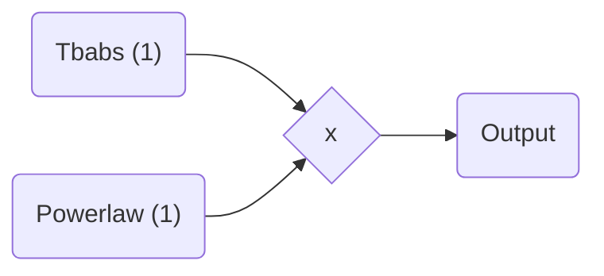

# JAXspec fitting speedrun

In this example, the basic spectral fitting workflow is illustrated on a XMM-Newton observation of the
pulsating ULX candidate from [Quintin & $al.$ (2021)](https://ui.adsabs.harvard.edu/abs/2021MNRAS.503.5485Q/abstract).

``` python
import numpyro
from jax.config import config

config.update("jax_enable_x64", True)
numpyro.set_platform("cpu")
numpyro.set_host_device_count(4)
```

## Define your model

The first step consists in building your model using the various components available in JAXspec.

``` python

from jaxspec.model.additive import Powerlaw
from jaxspec.model.multiplicative import Tbabs

model = Tbabs() * Powerlaw()
```

Which will produce the following model:



## Load your data

The second step consists in defining the data to be fitted.

``` python
from jaxspec.data.observation import Observation
obs_list = [
    Observation.pha_file('obs_1.pha'),
    Observation.pha_file('obs_2.pha'),
    Observation.pha_file('obs_3.pha')
    ]
```

## Perform the inference

``` python
import numpyro.distributions as dist
from jaxspec.fit import BayesianModel

prior = {
    "powerlaw_1": {
        "alpha": dist.Uniform(0, 10),
        "norm": dist.Exponential(1e4)
    },
    "tbabs_1": {"N_H": dist.Uniform(0, 1)}
}

forward = BayesianModel(model, obs_list)
result = forward.fit(prior, num_chains=4, num_samples=1000)
```

## Gather results

Finally, you can print the results, in a LaTeX table for example. The `result.table()`
will return a $\LaTeX$ compilable table. You can also plot the parameter covariances using the `plot_corner` method.

``` python
result.plot_corner()
```


You can also plot the posterior predictives

``` python
result.plot_ppc(0)
```


