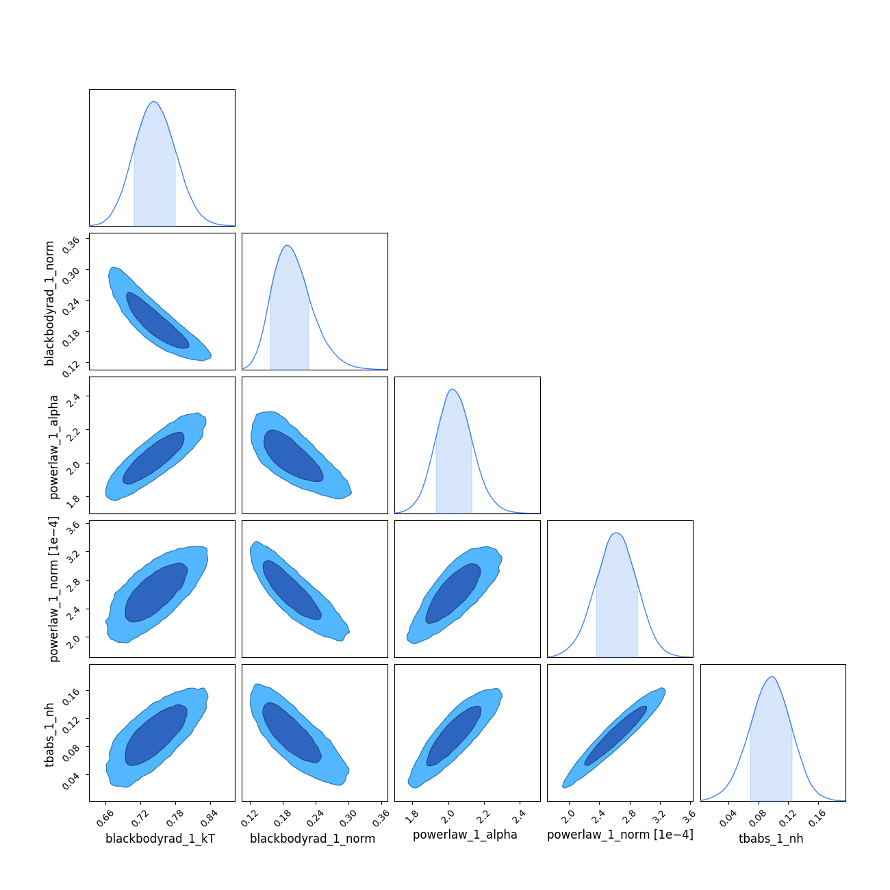
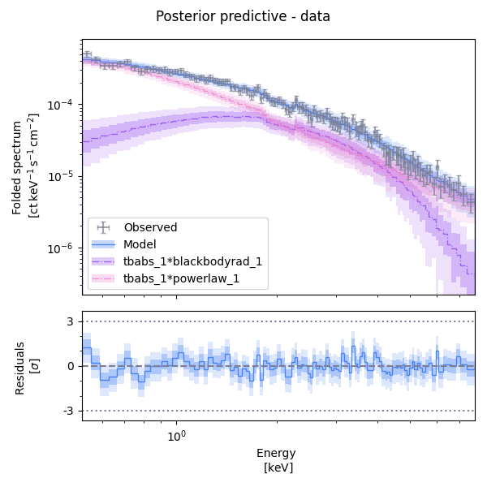

# `jaxspec` fitting speedrun

In this example, the basic spectral fitting workflow is illustrated on a XMM-Newton observation of the
pulsating candidate NGC 7793 ULX-4 from [Quintin & $al.$ (2021)](https://ui.adsabs.harvard.edu/abs/2021MNRAS.503.5485Q/abstract).

```python
import numpyro

numpyro.enable_x64()
numpyro.set_platform("cpu")
numpyro.set_host_device_count(4)
```

!!! Warning

    These lines are extremely important and must be run at the beginning of most of your scripts. It tells `JAX` how
    many cores you want to use and enforces the double precision, which is crucial when running MCMC.

## Define your model

The first step consists in building a model using various components available in `jaxspec`.

```python
from jaxspec.model.additive import Powerlaw, Blackbodyrad
from jaxspec.model.multiplicative import Tbabs

spectral_model = Tbabs()*(Powerlaw() + Blackbodyrad())
```

Which will produce the following model:


## Load your data

The second step consists in defining the data to be fitted.

```python
from jaxspec.data import ObsConfiguration
obs = ObsConfiguration.from_pha_file('your.pha', low_energy=0.3, high_energy=12) # (1)!
```

1.  In this example, we load the data using `#!python obs = load_example_obsconf("NGC7793_ULX4_PN")`
    which can be imported from `#!python jaxspec.data.util`

## Perform the inference

```python
import numpyro.distributions as dist
from jaxspec.fit import MCMCFitter

prior = {
    "powerlaw_1_alpha": dist.Uniform(0, 5),
    "powerlaw_1_norm": dist.LogUniform(1e-5, 1e-2),
    "blackbodyrad_1_kT": dist.Uniform(0, 5),
    "blackbodyrad_1_norm": dist.LogUniform(1e-2, 1e2),
    "tbabs_1_N_H": dist.Uniform(0, 1)
}

forward = MCMCFitter(spectral_model , prior , obs)
result = forward.fit(num_chains=4, num_warmup=1000, num_samples=1000)
```

## Gather results

Finally, you can print the results, in a LaTeX table for example. The `result.table()`
will return a $\LaTeX$ compilable table. You can also plot the parameter covariances using the `plot_corner` method.

```python
result.plot_corner()
plt.show();
```



```python
print(result.table())
```
```latex
\begin{table}
    \centering
    \caption{Results of the fit}
    \label{tab:results}
    \begin{tabular}{cccccc}
        \hline
		Model & blackbodyrad_1_kT & blackbodyrad_1_norm & powerlaw_1_alpha & powerlaw_1_norm & tbabs_1_N_H \\
		\hline
		Tbabs() * (Powerlaw() + Blackbodyrad()) & $0.744^{+0.035}_{-0.036}$ & $0.199^{+0.026}_{-0.044}$ & $2.024^{+0.100}_{-0.105}$ & $\left( 26.4^{+2.6}_{-2.9} \right) \times 10^{-5}$ & $0.098^{+0.029}_{-0.028}$ \\
		\hline
    \end{tabular}
\end{table}
```


You can also plot the posterior predictive spectra on this observation.

```python
result.plot_ppc()
plt.show();
```


