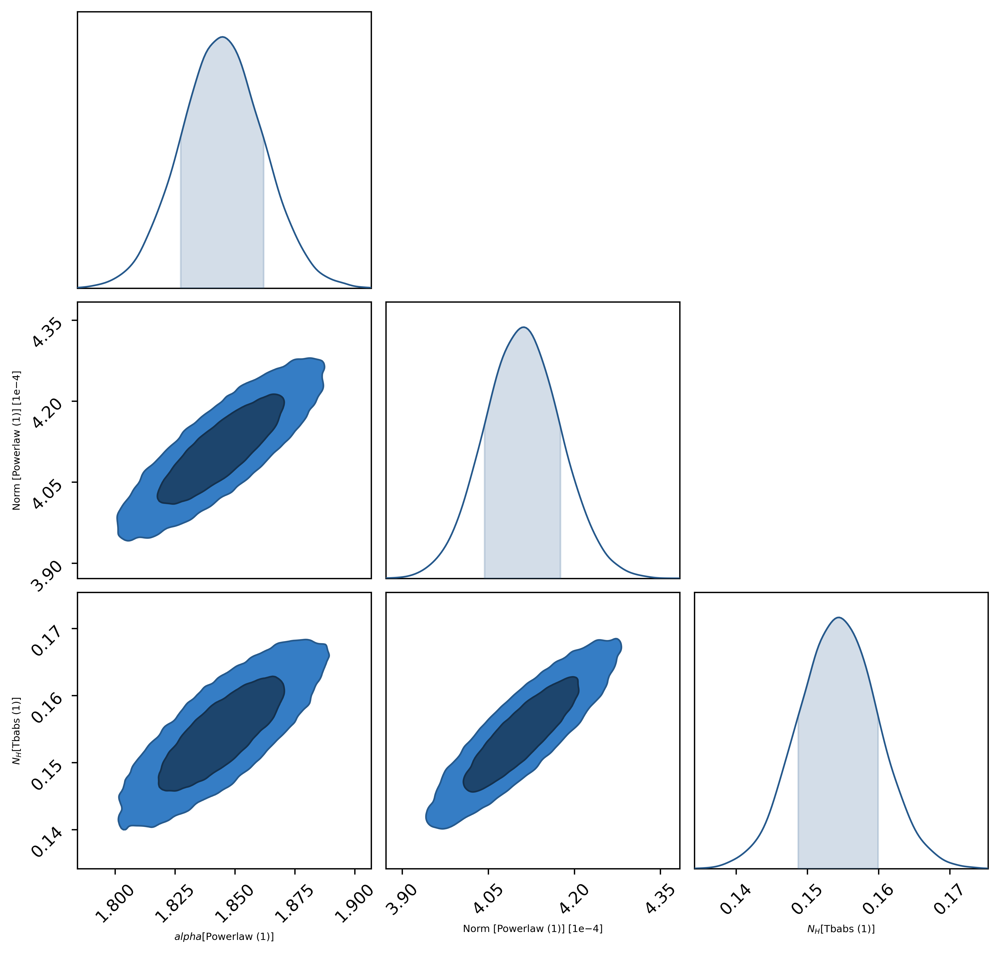

# Beginner examples

<div class="grid cards" markdown>

-   :material-clock-fast:{ .lg .middle } __JAXspec fitting speedrun__

    ---

    

    A quick overview of the general fitting workflow, including the data loading, model
    definition, inference process and results.

    [:octicons-arrow-right-24: Example here](fitting_example)

-   __Load your data in JAXspec__

    ---

    Change the colors, fonts, language, icons, logo and more with a few lines

    [:octicons-arrow-right-24: Customization](#)

-   __Model building made easy__

    ---

    ``` mermaid
    graph
        ce337930-834c-447b-afa8-b14eb3f73f61("Tbabs (1)")
        21aa645c-a55c-46e7-aac1-dabad13124fa{x}
        5153ffbf-4d64-44f0-a11b-91dd0dc7449a("Powerlaw (1)")
        1fbf61c1-aae4-46f8-ab38-a8cbfb1f2759{+}
        9fb2345d-c4f2-4d3a-a4ef-241d5da97b4c("Blackbody (1)")
        out("Output")
        ce337930-834c-447b-afa8-b14eb3f73f61 --> 21aa645c-a55c-46e7-aac1-dabad13124fa
        21aa645c-a55c-46e7-aac1-dabad13124fa --> out
        5153ffbf-4d64-44f0-a11b-91dd0dc7449a --> 1fbf61c1-aae4-46f8-ab38-a8cbfb1f2759
        1fbf61c1-aae4-46f8-ab38-a8cbfb1f2759 --> 21aa645c-a55c-46e7-aac1-dabad13124fa
        9fb2345d-c4f2-4d3a-a4ef-241d5da97b4c --> 1fbf61c1-aae4-46f8-ab38-a8cbfb1f2759
    ```

    Combine components to build a model in a very intuitive way

    [:octicons-arrow-right-24: Example here](build_model)

-   __Generate mock data__

    ---

    

    [:octicons-arrow-right-24: Example here](fakeits)

</div>

# Intermediate examples