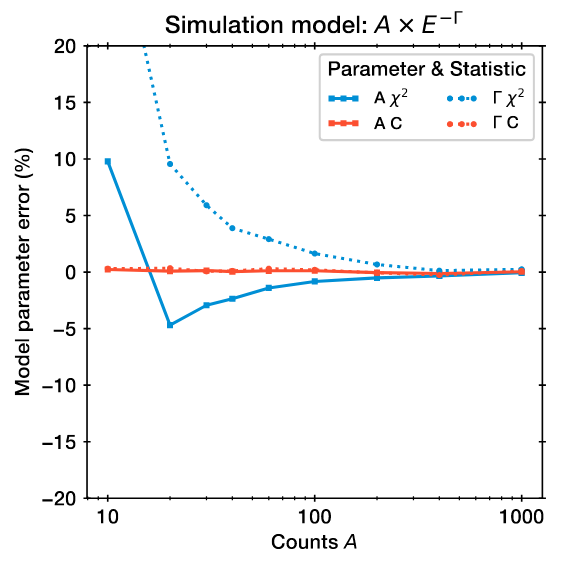

# Frequently asked questions

## Why should I use `jaxspec` over `xspec` or associated ?

## Why is there no $\chi^2$ statistic ?

When it comes to define the fitting statistic, the question of either using $\chi^2$ or C-stat arises
pretty often. In a Bayesian approach, this is perfectly equivalent to assume either a Gaussian or a Poisson
likelihood for the data you are observing. As the acquisition of an X-ray spectrum is in practice a counting
process, it is natural to study it under a Poisson likelihood. However, in older times, the computation of
associated errors, goodness of fit and other stats was much simpler and faster using a Gaussian likelihood or
$\chi^2$ since most of the expression can be analytically derived. Moreover, the Poisson distribution in high counts
is well approximated by a Gaussian distribution when the rate is high enough ($\lambda \gtrsim 1000$). Since
most of the studied sources were bright enough, this was no issue, but we are now studying fainter sources. Most recent
publications on the subject agree that using the C-stat at all count rates is necessary to ensure an unbiased estimate
of the parameters.(e.g. [Kaastra, 2017](https://arxiv.org/abs/1707.09202) or
[Buchner & Boorman, 2023](https://arxiv.org/abs/2309.05705)).

{width=250, align=left}

This figure shows a comparison of true error on the parameters $(A, \Gamma)$ of a power-law recovered by fitting under
$\chi^2$ or C-statistic (Adapted from [Buchner & Boorman, 2023](https://arxiv.org/abs/2309.05705)) and highlights the
systematic biases that arise at low counts.

As we are working in a Bayesian framework, and not computing directly the
errors but rather getting samples of the posterior distributions of our parameters, using Poisson likelihood is not an
issue. The samples will be distributed accordingly to their intrinsic dispersions, in a representative way of the error
in the parameter space. Because of this, we choose to ensure a Poisson likelihood in every situation, which is
equivalent to fit under C-stat.