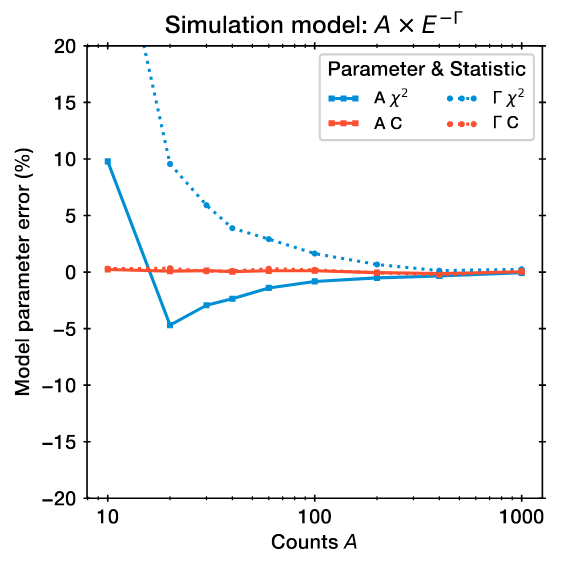

# Frequently asked questions

## How can I load multiple spectra to fit ?

Simply pass a list or dictionnary of [`ObsConfiguration`][jaxspec.data.obsconf.ObsConfiguration] objects when building your
fitter object.

## Why should I use `jaxspec` over `xspec` or associated ?

We have taken great care to make `jaxspec` as easy to use as possible. It can be installed with `pip install jaxspec`
and that's it. It is also easy to use and provides well documented use cases. The default methods are fast yet robust
for inferring model parameters in most usecases. It is also easy to integrate with other software as it exposes the
likelihood function, so if you want to use your own methods and just need a forward model with instrument folding, we
provide a compilable and GPU friendly one that can also be used as your usual `numpy` function.

## How can I compare `jaxspec` and `xspec` fitting results ?

If you want to check that `jaxspec` gives correct values compared to `xspec`, you need to make sure that the results of
both solutions are comparable. To do this, make sure you do a blind fit with `xspec` and use `Cstat` as the fit statistic.
Also with `jaxspec`, make sure that you explicitly use a uniform prior for each of your parameters.

Beware that a few models deliberately depart from the `xspec` parameter conventions, so their fitted values are not
directly comparable. The multicolor disk models ([`Diskbb`][jaxspec.model._additive.disk.Diskbb] and
[`Diskpbb`][jaxspec.model._additive.disk.Diskpbb]) normalize by the photon flux over a band rather than by
$\cos i (r_{\text{in}}/d)^2$. Their `norm` is therefore the unabsorbed photon flux in the configured `flux_band`
(0.5--10 keV by default), and should not be compared directly with XSPEC's fitted normalization. The equivalent
XSPEC value is recorded for every draw as `norm_xspec`: fully shared components appear in inference data as
`derived.spectrum.<component>.norm_xspec`, while observation-scoped components appear as
`derived.forward.spectrum.<observation>.<component>.norm_xspec`. The chain table and plots display the same value
as `<component>.norm_xspec`, with an observation label when scoped.

## Why is there no $\chi^2$ statistic ?

When it comes to define the fitting statistic, the question of either using $\chi^2$ or C-stat arises
pretty often. In a Bayesian approach, this is perfectly equivalent to assume either a Gaussian or a Poisson
likelihood for the data you are observing. As the acquisition of an X-ray spectrum is in practice a counting
process, it is natural to study it under a Poisson likelihood. However, in older times, the computation of
associated errors, goodness of fit and other stats was much simpler and faster using a Gaussian likelihood or
$\chi^2$ since most of the expression can be analytically derived. Moreover, the Poisson distribution in high counts
is well approximated by a Gaussian distribution when the rate is high enough ($\lambda \gtrsim 1000$). Since
most of the studied sources were bright enough, this was no issue, but we are now studying fainter sources. Most recent
publications on the subject agree that using the C-stat at all count rates is necessary to ensure an unbiased estimate
of the parameters.(e.g. [Kaastra, 2017](https://arxiv.org/abs/1707.09202) or
[Buchner & Boorman, 2023](https://arxiv.org/abs/2309.05705)).

{ width="250" align="left" }

This figure shows a comparison of true error on the parameters $(A, \Gamma)$ of a power-law recovered by fitting under
$\chi^2$ or C-statistic (Adapted from [Buchner & Boorman, 2023](https://arxiv.org/abs/2309.05705)) and highlights the
systematic biases that arise at low counts.

As we are working in a Bayesian framework, and not computing directly the
errors but rather getting samples of the posterior distributions of our parameters, using Poisson likelihood is not an
issue. The samples will be distributed accordingly to their intrinsic dispersions, in a representative way of the error
in the parameter space. Because of this, we choose to ensure a Poisson likelihood in every situation, which is
equivalent to fit under C-stat.
